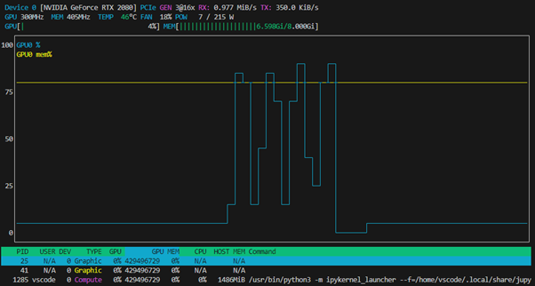

# How Batch Size Affects Training Speed in fastai
---

In this post, I’ll walk through an experiment I ran using the [fastai](https://www.fast.ai) library to investigate how **batch size impacts training time** on both **GPU and CPU**. This was a practical learning exercise inspired by one of our AI assignments in ELEC4702.

---
1. TOC
{:toc}

## The Dataset and Task

I built a simple binary classifier to distinguish between **bird images** and **woodland scenes**. I scraped around 600 images using the `duckduckgo_search` module and organized them using fastai's `DataBlock` API.

Each image was resized to 192×192 and then split into 80% training and 20% validation sets. The final model was a ResNet18 trained using `learn.fine_tune(3)`.

---

## Testing Batch Sizes

I tried different batch sizes to observe how they affect training time on the GPU:

```python
bs_values = [16, 32, 64, 128, 256]
```
## GPU Results: Training Time vs Batch Size

I experimented with different batch sizes and recorded the time taken to complete training (`learn.fine_tune(3)`) while using a GPU.

| **Batch Size** | **Training Time (GPU)** |
|----------------|--------------------------|
| 16             | 14.1 seconds             |
| 32             | 9.7 seconds              |
| 64             | 9.3 seconds              |
| 128            | 10.6 seconds             |
| 256            | 12.8 seconds             |

The fastest training occurred with **batch size 64**, striking a good balance between GPU utilization and memory load.

---

## Comparing With CPU

To understand the **advantage of using a GPU**, I ran the same training process using a **CPU-only** environment (by switching to a CPU-based dev container in VS Code). For batch size 64, training took:

- **CPU training time:** 425.7 seconds  
- **GPU training time:** 9.3 seconds

Using this, I calculated the speedup using the formula:

$$
\text{Speedup} = \frac{\text{CPU Time}}{\text{GPU Time}} = \frac{425.7}{9.3} = 45.77
$$

This shows that the GPU was **~46× faster** than the CPU for this task — a massive difference, especially when working with deep learning models.

---

## Monitoring with `nvtop`

To monitor GPU usage during training, I ran the `nvtop` tool in a second terminal tab. It clearly showed GPU spikes during each epoch of training, confirming proper GPU utilisation and memory activity.


---

## What I Learned from fastai

This project helped solidify some core fastai concepts:

- How to use the `DataBlock` API to control preprocessing and loading
- The impact of `bs` (batch size) on memory and speed
- How to interpret training metrics (like error rate)
- Real benefits of GPU acceleration in training deep learning models

I also got better at using tools like `nvtop`, Python timing functions, and `dls.show_batch()` for debugging.

---

## Final Thoughts

Finding the right batch size is often about **balancing performance with memory limits**. fastai makes it easy to experiment quickly and visualize the impact of each change. This project demonstrated how drastically **hardware choices** affect machine learning workflows.

Thanks for reading! 👋 Check out more of my projects [on GitHub](https://github.com/tara-bash).
